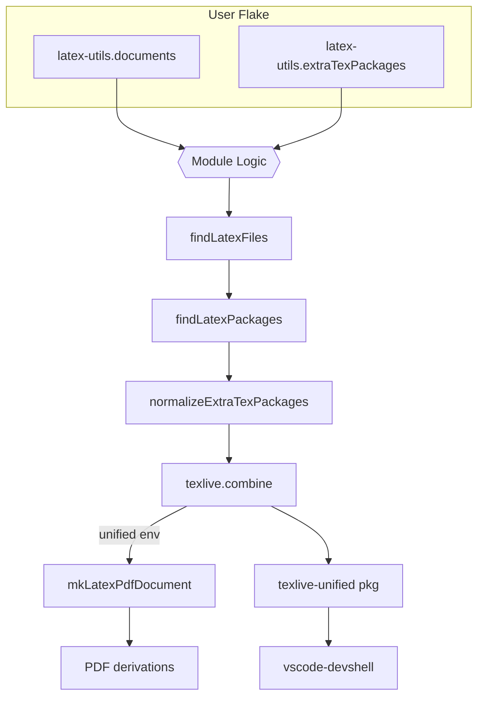

# ✨ **latex-utils Architecture**

> A high‑level technical map for human contributors *and* LLM coding agents.

---

## 1  Purpose & Context

`latex-utils` is a **flake‑parts** module plus helper libraries that turn a directory of LaTeX sources into **reproducible Nix packages**, automatically resolve TeX Live dependencies, and expose a unified TeX tool‑chain for editors and CI pipelines fileciteturn1file0. The project exists to:

* remove boiler‑plate from LaTeX builds;
* guarantee identical PDFs across machines using Nix’s immutability;
* scale from a single paper to many documents without duplicated config;
* provide editor/IDE integration out‑of‑the‑box.

Typical downstream users add the module, list their documents, and run `nix build`—that’s it fileciteturn1file1.

---

## 2  Overview

The **flake module** (in `modules/latex-utils.nix`) orchestrates discovery → normalisation → build. Library helpers (in `lib/`) implement the heavy lifting, while *per‑system* outputs wire everything into devshells, apps and CI artifacts.

---

## 3  Key Components

| Path                      | Role                                                                                                                 |
| ------------------------- | -------------------------------------------------------------------------------------------------------------------- |
| `modules/latex-utils.nix` | Flake‑parts module exposing the public options, per‑system logic, and unified TeX environment fileciteturn1file15 |
| `lib/` folder             | Pure Nix helpers → file discovery, package parsing, font‑cache, PDF builds fileciteturn1file12                    |
| `tests/`                  | nix‑unit regression suites validating parsing, normalisation & unified env fileciteturn1file4                     |
| `docs/`                   | Human‑readable guides & ADRs; generated by agents into `docs/agent_logs/`                                            |
| `template/`               | Minimal consumer flake scaffolding.                                                                                  |

---

## 4  Public API & Interfaces

### 4.1 Flake Module Options

| Option                             | Type                   | Purpose                                                                                                           |
| ---------------------------------- | ---------------------- | ----------------------------------------------------------------------------------------------------------------- |
| **`latex-utils.documents`**        | list of submodules     | Declare each PDF to build; fields: `name`, `src`, `inputFile`, `extraTexPackages`, etc. fileciteturn1file15    |
| **`latex-utils.extraTexPackages`** | homogeneous list \| fn | Global TeX pkgs for *all* docs. Accepts strings, derivations or a function `discovered: …` fileciteturn1file16 |

> **Edge‑case:** lists must be homogeneous—mixing strings and derivations triggers a validation error fileciteturn1file17.

### 4.2 Library/SDK Surface

* `findLatexFiles(basePath)` – recursive source scan.
* `findLatexPackages(fileContents)` – regex parse of `\usepackage` lines.
* `normalizeExtraTexPackages(extra, discovered)` – converts multiple input shapes to an attr‑set compatible with `texlive.combine`.
* `mkLatexPdfDocument{…}` – parametric builder that wraps `latexmk`, handles font‑cache, and outputs a derivation.
* `mkFontconfigCache(pkgs, fonts)` – shared font‑cache derivation.

All functions are pure Nix and live under `lib/` fileciteturn1file12.

### 4.3 CLI / Flake Outputs

| Output                        | Description                                                               |
| ----------------------------- | ------------------------------------------------------------------------- |
| `packages.<doc>`              | One package per document (`paper`, `slides`, …).                          |
| `packages.texlive-unified`    | Combined TeX Live env with *all* pkgs fileciteturn1file9.              |
| `packages.latexmk-unified`    | `latexmk` wrapper bound to the unified env.                               |
| `devShells.vscode`            | VS Code shell incl. LaTeX Workshop + LTeX settings fileciteturn1file9. |
| `apps.vscode-settings-custom` | Generate customised VS Code settings via CLI fileciteturn1file14.      |

---

## 5  Data Flow / Control Flow

1. **Discovery** – For each document the module calls `findLatexFiles` → `findLatexPackages` to build an attr‑set of required TeX pkgs.
2. **Merge** – Document‑level and module‑level `extraTexPackages` are normalised and merged (document packages win on conflict) fileciteturn1file19.
3. **Combine** – All unique packages feed `texlive.combine`, producing `texlive-unified`.
4. **Build** – `mkLatexPdfDocument` compiles each source using `latexmk`, reusing the pre‑built font cache.
5. **Expose** – Per‑system outputs wire PDF packages, devShells and helper apps.

---

## 6  Technologies & Frameworks

* **Nix Flakes + flake‑parts** – declarative build & modularity.
* **TeX Live (2024+)** – modern pkgs with wrapper attr‑sets; legacy structure unsupported fileciteturn1file14.
* **nix‑unit** – test harness for library functions.
* **treefmt / alejandra / latexindent** – code formatting guardrails.
* **Garnix** – remote binary cache via `garnix.yaml`.

---

## 7  Design Principles & Conventions

* **Reproducibility first** – builds are pure; inputs are pinned; font cache is deterministic.
* **Declarative API** – users state *what* to build, not *how*.
* **Single Source of Truth** – document configs drive both build and IDE env.
* **Fail‑fast validation** – option types, homogeneous list check, and contextual error messages.
* **Extensibility** – options accept functions so users can inject logic.

Coding guidelines: keep Nix expressions pure, favour attr‑sets over lists of tuples, and document option examples with `lib.literalExpression` blocks.

---

## 8  Common Pitfalls & Gotchas

1. **Mixed‑type `extraTexPackages` lists** – will error; split into two lists or convert to derivations.
2. **Old TeX Live packages** – pre‑2024 nixpkgs lack the modern wrapper; update nixpkgs if you see missing `pkgs` attributes fileciteturn1file14.
3. **Undetected packages** – add `% CTAN:` comments or use `extraTexPackages`.
4. **Font discovery** – ensure fonts are in TeX Live; external system fonts are ignored inside the sandbox.

---

## 9  Deployment & Environments

* **Local dev** – `nix develop` drops you into a shell with `latexmk`, `lualatex`, etc.
* **CI/CD** – any Nix‑capable runner (e.g. GitHub Actions, Garnix) can run `nix flake check` and cache results.
* **Binary cache** – enable Cachix/Garnix to avoid recompiling TeX Live.
* **VS Code** – `devShells.vscode` auto‑links `.vscode/settings.json` so agents and humans share a consistent environment fileciteturn1file9.

---

## 10  Limitations & Future Work

* Legacy TeX Live structure not supported (could add adapter).
* Windows is untested (requires WSL or nix‑compat layer).
* Additional IDE recipes (Neovim treesitter, Emacs AUCTeX) welcome.
* Potential for incremental builds vs full `latexmk` rebuilds.

---

## 11  Getting Started & Contributing

1. **Clone & enter**: `git clone … && cd latex-utils && nix develop`.
2. **Run tests**: `nix flake check`.
3. **Add docs**: list your PDFs in `latex-utils.documents`.
4. **Commit policy**: format with `mission-control fmt`; all PRs must pass nix‑unit.
5. **ADR process**: add decision records under `docs/decisions/` using the template `000-initial-template.md`.

See **README.md** for a hands‑on quick‑start and **docs/** for deep‑dives. Happy typesetting! 🎉
